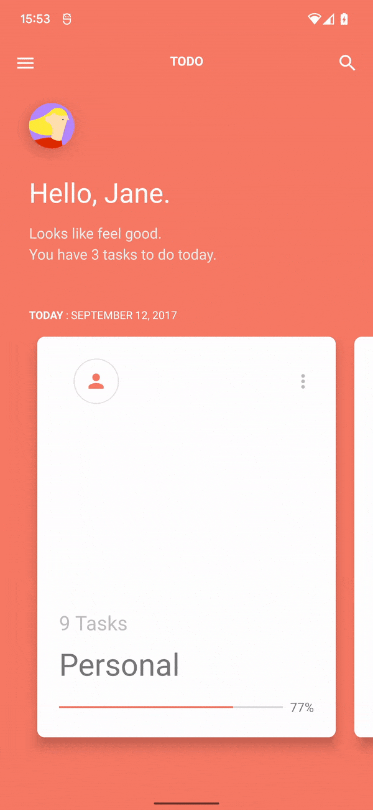

# DesignStudio
This repository will contain a set of individual projects to showcase different designs studies/experiments. The goal is to learn to build great UI.

## Non-Goals

* Doesn't provide a guideline of what an architecture should look like. This could be a different showcase project in the future.
* The project is not production ready, the focus was only on the implementation of the design.

## Studies

### Todo Concept by Jae-seong, Jeong 
We were looking for a design that we could implement as a show case project. We came across the fantastic work of [Jae-seong, Jeong with over 10k likes at Dribbble.](https://dribbble.com/shots/3812962-iPhone-X-Todo-Concept)

* Transitions
* Animations
* Different versions
	* View-based
	* Jetpack Compose (WIP)

# License
    Copyright 2019 - 2021 Block & Block

    Licensed under the Apache License, Version 2.0 (the "License");
    you may not use this file except in compliance with the License.
    You may obtain a copy of the License at

       http://www.apache.org/licenses/LICENSE-2.0

    Unless required by applicable law or agreed to in writing, software
    distributed under the License is distributed on an "AS IS" BASIS,
    WITHOUT WARRANTIES OR CONDITIONS OF ANY KIND, either express or implied.
    See the License for the specific language governing permissions and
    limitations under the License.
